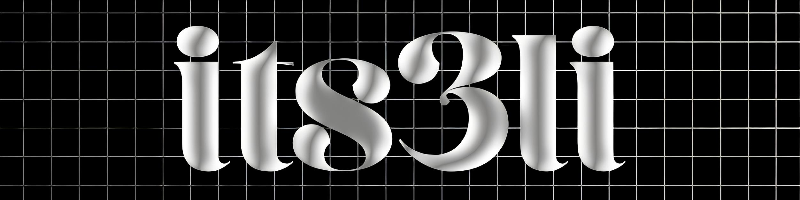

  

# Hi there, I'm Ali 👋 Front-End Developer from Egypt 🇪🇬

Welcome to my corner of GitHub! Since 2022, I've been into web development, focusing on building websites and apps that are **fast, easy to use, and don't cause headaches to maintain**.

I'm also really interested in **AI tools and prompt engineering**, figuring out cool ways they can make web development even better.

---

## 🚀 What I Enjoy Doing

* **Building Front-Ends:** Creating websites and apps that look good and work smoothly, mostly using JavaScript and its friends.
* **Playing with AI:** Seeing how AI can help with coding tasks, design ideas, and just making development smoother.

---

## ✨ Currently Working On: Orion

Right now, a lot of my energy is going into **Orion - your digital partner**. It's my project aiming to be a helpful resource for digital stuff, including:

* **Web Dev Courses:** Sharing what I know to help others learn.
* **Custom Websites/Apps:** Building digital tools tailored to specific needs.
* **Web Design:** Making things look good online.

---

## 💻 My Tech Toolbox

**Core Frontend:**

  
  
  
  

**Frameworks & Libraries:**

  
  

**Build Tools & Environment:**

  
  

**Deployment & Version Control:**

  
  

---

## 📊 My GitHub Stats

---

## 📫 Get in Touch!

Always happy to chat about cool projects, new ideas, or if you think we could build something great together. Drop me a line!

